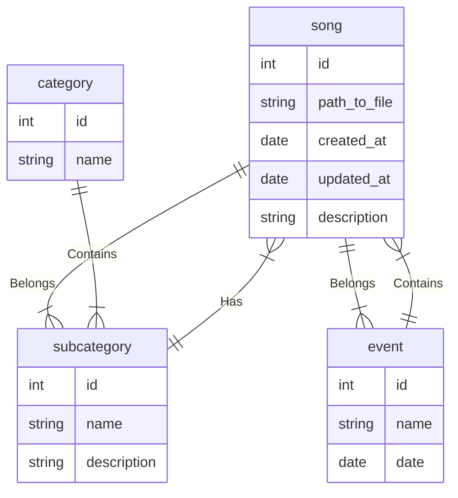

# Song-manager

## Database

```mermaid
erDiagram
    song ||--1+ subcategory : Belongs
    song ||--1+ event : Belongs
    song {
        int id
        string path_to_file
        date created_at
        date updated_at
        string description
    }
    category ||--1+ subcategory : Contains
    category {
        int id
        string name
    }
    subcategory ||--1+ song : Has
    subcategory {
        int id
        string name
        string description
    }
    event ||--1+ song : Contains
    event {
        int id
        string name
        date date
    }
```