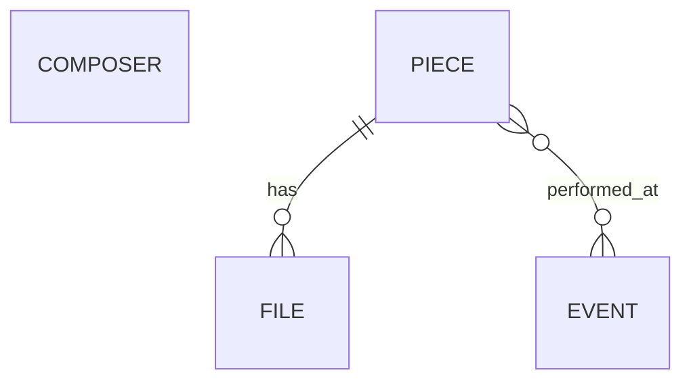

# MusMGR: a repertoire manager and event tracker

MusMGR is a webapp built with a SvelteKit frontend, a Go backend (Gin), and PostgreSQL for persistence. SQL queries are handled via sqlc with goose for migrations, and local development is containerized with Docker Compose.

MusMGR focuses on tracking repertoire and performance events. It is not a music streaming or playback platform.

## Tech stack

### Frontend

- [SvelteKit](https://kit.svelte.dev/)
- [Vitest](https://vitest.dev/)
- [Playwright](https://playwright.dev/)

### Backend

- [Go](https://go.dev/) with [Gin](https://github.com/gin-gonic/gin)
- [PostgreSQL](https://www.postgresql.org/)
- [goose](https://pressly.github.io/goose)
- [sqlc](https://sqlc.dev/)
- [MinIO](https://www.min.io/)

### Deployment/Testing

- [Docker Compose](https://docs.docker.com/compose)

## Architecture

### Backend

The backend is written in Go using Gin, with a data layer using PostgreSQL and MinIO for assets and entities. It models the core domain (pieces, events, and files), enforces access control, and is responsible for persistence and file storage.

#### Routing and request scoping

There are two explicit routers:

- **Public router**: read-only (GET) endpoints intended for publicly accessible data
- **Admin router**: mutation and deletion of assets

Both routers pass through a shared policies middleware. The middleware injects a request scope (public or admin), which is later enforced at the domain layer through explicit policy checks.

This separation makes it possible to introduce explicit authentication later with minimal changes.

#### Domain and persistence

The core domain models:

- Pieces
- Events (performances of pieces)
- Files (scores, recordings, previews, and derivatives)
- Composer (the subject of the application)

The relationships are:

`Composer` is a singleton entity representing the subject of the application. `Piece` are implicitly scoped to this `Composer` by the domain.

`Piece` and `Event` are the primary entities the application tracks.

`File` are metadata entities that carry information relative to classification (public or protected), origin (uploaded or system generated), and optional parent relationships for derivatives. They represent objects in storage.

PostgreSQL is the single source of truth. SQL queries are static and compiled to Go code using `sqlc`. Operations that involve both database and storage interactions execute within transactions to preserve consistency.

#### File ownership and storage abstraction

The backend owns all file access. Clients never interact directly with object storage.

Storage is abstracted behind a generic interface with two implementations:

- Local filesystem (development)
- S3-compatible object storage via MinIO (recommended for production)

The backend remains authoritative over every file operation, including uploads, streaming, classification based access control, and lifecycle management.

### Frontend

The frontend is the presentation layer of the application. It consumes the backend API and renders public and admin views according to the exposed scope.

#### Domain separation

This frontend can provide both the `admin` and `public` builds through the `VITE_FRONTEND_BUILD_MODE` environment variable. This is then used as a variable that can be evaluated at build time forming the `IS_ADMIN` constant for conditional UI presentation.

#### Pages

Each one of the main entities has its own page. The one exception is files, which are presented alongside the piece.

#### Current status

- Public UI:
    - concept completely implemented
- Admin UI:
    - functional for creation and most updates
    - deletion function deferred for when a dedicated dashboard exists - fully implmented in the backend

---

## Project status

MusMGR is under active development. APIs, data models, and deployment details may change as the project evolves.

## Future plans

### UI changes

- Create an admin dedicated dashboard:
    - Allow deletion in the UI
- Create dedicated file viewers
- Allow video visualization in the UI
- Create a different page for acousmatic pieces

### Backend changes

- Make derivative creation more robust
- Create DTO for responses
- Separate controllers more explicitly

---

## Contributors

- [**acmota2**](https://github.com/acmota2) - original author and maintainer

Additional contributions may be listed here in the future.
